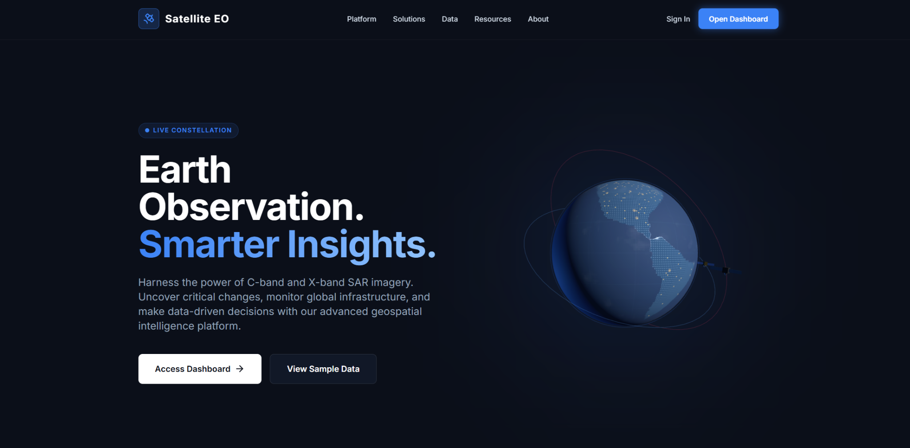
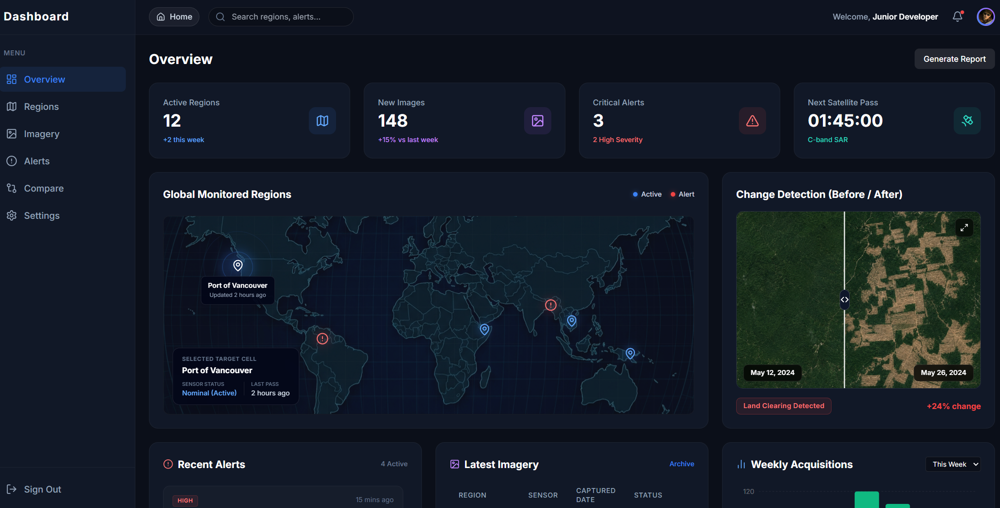

# Satellite Earth Observation Dashboard

A frontend-only React project inspired by satellite Earth observation workflows and client-facing geospatial intelligence dashboards.

The app presents a cinematic satellite landing page and a dark-themed operations dashboard where users can monitor regions, review satellite imagery activity, inspect alerts, compare before/after imagery, and view acquisition metrics using mock data.

## Features

### Landing Page


### Dashboard Overview


### Landing Page

- Dark space-themed hero section
- Animated Earth/satellite visual built with Three.js
- Navigation bar with dashboard entry point
- Feature cards explaining region monitoring, image comparison, and alerts
- Responsive layout for desktop and smaller screens

### Dashboard

- Sidebar navigation and top dashboard bar
- KPI cards for active regions, new images, critical alerts, and next satellite pass
- Global monitored regions map with interactive pins and selected-region details
- Before/after change detection comparison slider
- Recent alerts panel with severity levels
- Latest imagery table showing region, sensor, date, and processing status
- Weekly acquisition chart built with Recharts
- Mock data structure separated into reusable data files

## Tech Stack

- React
- TypeScript
- Vite
- Tailwind CSS
- React Router
- Recharts
- Three.js
- Lucide React

## Getting Started

### Prerequisites

Install Node.js and npm.

Recommended:

```bash
node --version
npm --version
```

### Installation

Clone the repository:

```bash
git clone https://github.com/YOUR_USERNAME/satellite-earth-observation-dashboard.git
cd satellite-earth-observation-dashboard
```

Install dependencies:

```bash
npm install
```

Run the development server:

```bash
npm run dev
```

Open the local URL shown in the terminal, usually:

```txt
http://localhost:5173
```

## Available Scripts

```bash
npm run dev
```

Starts the local development server.

```bash
npm run build
```

Runs TypeScript checks and creates a production build.

```bash
npm run preview
```

Previews the production build locally.

## Mock Data

This project is frontend-only. All dashboard values come from local mock data files in `src/data`.

Examples:

- `regions.ts` stores monitored regions and map-pin positions.
- `alerts.ts` stores alert type, severity, region, and time.
- `imagery.ts` stores recent satellite image acquisitions.
- `acquisitions.ts` stores chart data for weekly acquisition activity.
- `dashboardStats.ts` stores KPI card values.

No backend, database, or real satellite API is required.

## Future Improvements

Possible next steps:

- Add a real map library such as Mapbox GL, Leaflet, or Cesium
- Add authentication and role-based dashboard views
- Replace mock data with a FastAPI backend
- Store regions and alerts in PostgreSQL/PostGIS
- Add report export functionality
- Add more realistic satellite tasking workflow screens
- Add unit tests for reusable components
